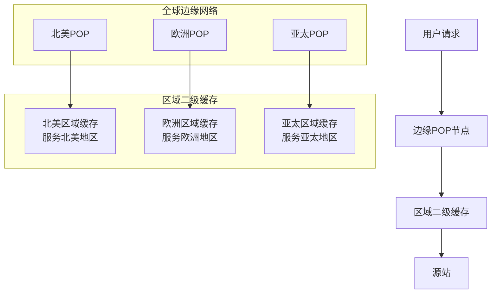
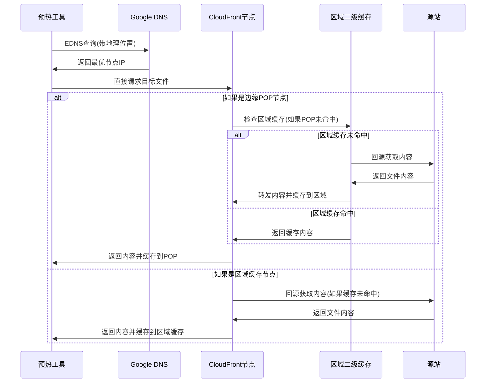
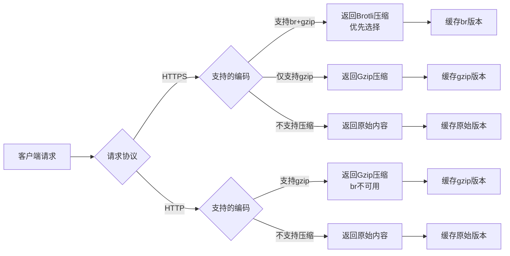
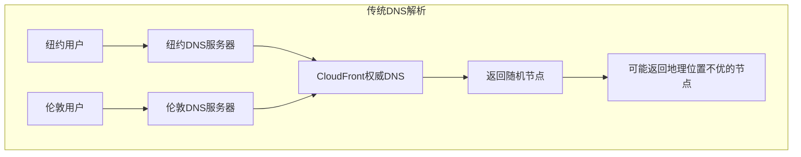
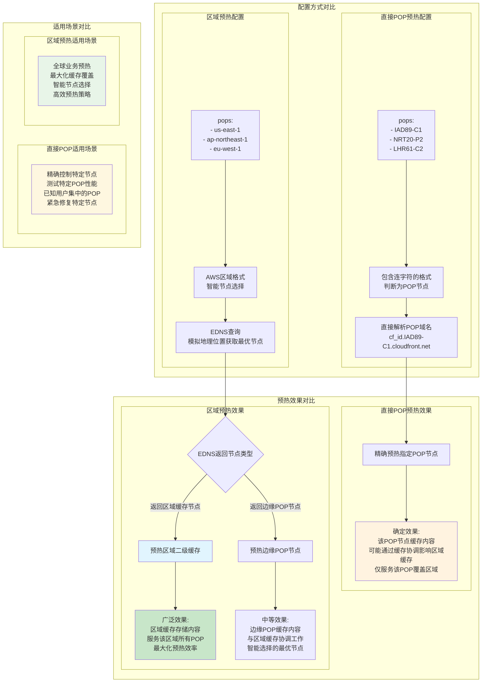
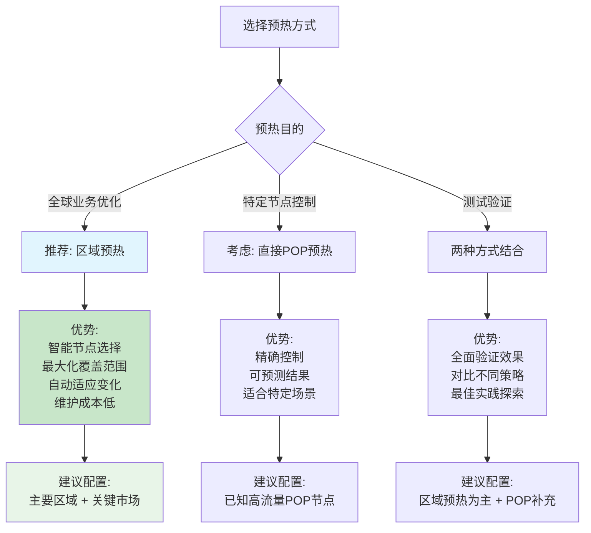
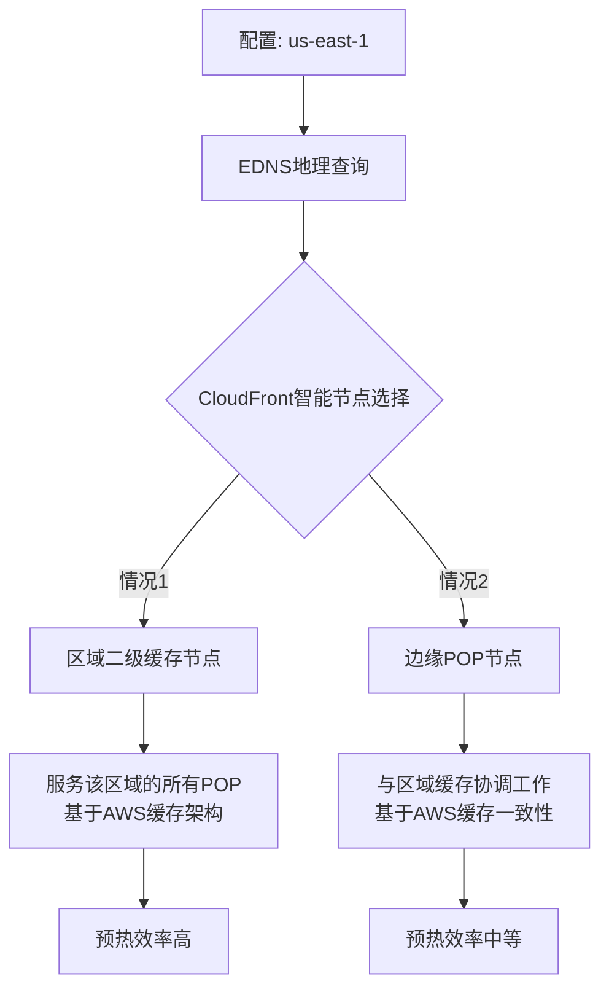
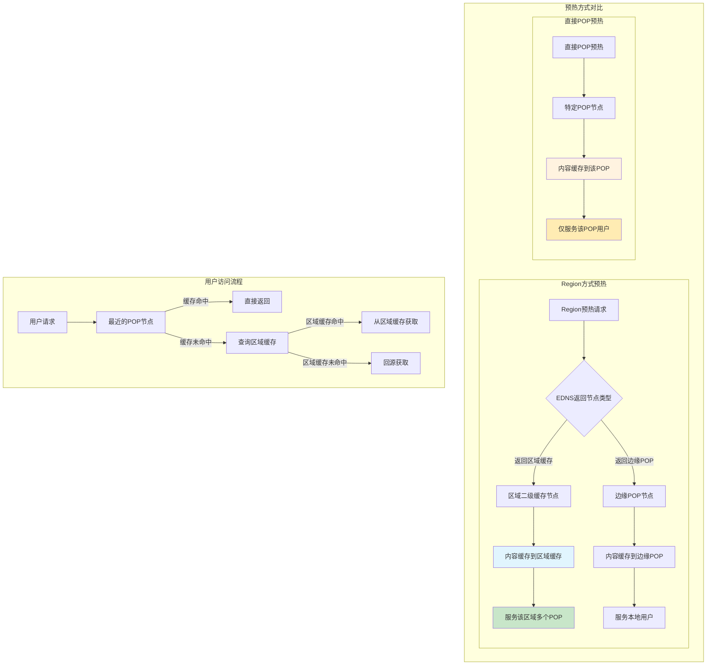

# CloudFront 预热方案详解

> **项目地址**: [https://github.com/tansoft/aws-useful-code/tree/main/cloudfront-prewarm](https://github.com/tansoft/aws-useful-code/tree/main/cloudfront-prewarm)

## 概述

CloudFront预热工具是一个专业的AWS CDN缓存预热解决方案，通过智能化的预热策略，确保全球用户在首次访问时就能获得最佳的内容加载速度。本工具采用先进的EDNS Client Subnet技术，精确定位目标缓存节点，实现高效的内容分发网络优化。

## CloudFront架构与预热原理

### CloudFront网络架构



### 预热工作流程



## 核心技术特性

### 1. 智能节点定位技术

#### 什么是EDNS？

**EDNS (Extension Mechanisms for DNS)** 是DNS协议的扩展机制，允许在DNS查询中携带额外的信息。EDNS Client Subnet (ECS) 是EDNS的一个重要扩展，它允许DNS查询携带客户端的地理位置信息。

**传统DNS查询的局限性**：


**EDNS Client Subnet的改进**：


#### EDNS Client Subnet原理
```python
def dns_query_with_subnet(domain: str, nameserver: str, subnet: str):
    # 创建DNS查询消息
    query = dns.message.make_query(domain, dns.rdatatype.A)
    # 添加地理位置信息
    client_subnet = dns.edns.ECSOption(address=network, srclen=prefix)
    query.use_edns(options=[client_subnet])
    # 获取地理位置最优的CloudFront节点
    response = dns.query.udp(query, nameserver, timeout=timeout)
    return response
```

**EDNS Client Subnet工作机制**：

1. **子网信息构建**：
   ```python
   # 从区域IP构建子网信息
   region_ip = "52.95.110.1"  # us-east-1的代表IP
   subnet = "52.95.110.0/24"  # 构建/24子网
   ```

2. **EDNS选项添加**：
   ```python
   # 创建ECS选项，告诉DNS服务器查询来源
   client_subnet = dns.edns.ECSOption(
       address="52.95.110.0",  # 网络地址
       srclen=24               # 子网掩码长度
   )
   ```

3. **智能节点返回**：
   - DNS服务器根据子网信息判断地理位置
   - 返回该地理位置最优的CloudFront节点IP
   - 确保预热的节点就是用户实际会访问的节点

**技术优势**：
- **地理精确性**：基于真实的地理位置信息进行节点选择
- **路由一致性**：预热路径与用户访问路径完全一致
- **智能负载均衡**：CloudFront可以根据实时负载情况返回最优节点
- **标准协议支持**：EDNS是RFC标准，被全球DNS基础设施广泛支持

### 2. 双重节点选择策略


### 3. 多维度预热矩阵

| 维度 | 配置选项 | 预热效果 |
|------|----------|----------|
| **地理维度** | 15个核心区域 | 全球覆盖 |
| **编码维度** | gzip, br, 无压缩 | 适配不同客户端 |
| **协议维度** | HTTP/HTTPS | 安全性保障 |
| **文件维度** | 批量文件列表 | 一次性预热 |

## 快速开始

**注意**：README中的原始下载链接格式需要修正：
```bash
# README中的链接（GitHub blob链接，不能直接下载）
wget https://github.com/tansoft/aws-useful-code/blob/main/cloudfront-prewarm/prewarm.py -O prewarm.py

# 正确的下载链接（raw文件链接）
wget https://raw.githubusercontent.com/tansoft/aws-useful-code/main/cloudfront-prewarm/prewarm.py -O prewarm.py
```

### 环境准备

```bash
# 下载预热脚本（使用正确的raw链接）
wget https://raw.githubusercontent.com/tansoft/aws-useful-code/main/cloudfront-prewarm/prewarm.py -O prewarm.py

# 安装基础依赖
pip install requests dnspython

# 如需使用缓存失效功能，额外安装
pip install pyyaml boto3

# 配置AWS凭证（如需使用缓存失效功能）
aws configure
```

### 基础配置

创建 `config.yaml` 配置文件：

```yaml
# CloudFront域名配置
cloudfront_url: "d1234567890.cloudfront.net"
host: "cdn.example.com"
protocol: "https"

# 预热文件列表
files: |
  /static/js/main.js
  /static/css/style.css
  /images/banner.jpg
  # 特殊字符文件需要URL编码
  /docs/user%20guide.pdf

# 压缩编码策略
encodings:
  - "gzip, br"  # 现代浏览器
  - "gzip"      # 兼容旧浏览器
  - ""          # API客户端

# 目标区域选择
pops:
  - "us-east-1"      # 北美东部
  - "eu-west-1"      # 欧洲西部
  - "ap-southeast-1" # 亚太东南

# 缓存失效选项（可选）
invalidation: false
```

### 执行预热

```bash
python3 prewarm.py
```

## 最佳实践指南

### 1. 区域选择策略

#### 全球业务推荐配置
```yaml
pops:
  # 一级优先区域（核心市场）
  - "us-east-1"      # 北美主要节点
  - "eu-west-1"      # 欧洲主要节点  
  - "ap-southeast-1" # 亚太主要节点
  
  # 二级扩展区域
  - "us-west-2"      # 北美西部
  - "eu-central-1"   # 欧洲中部
  - "ap-northeast-1" # 日韩市场
  
  # 新兴市场
  - "sa-east-1"      # 南美市场
  - "me-central-1"   # 中东市场
  - "ap-south-1"     # 印度市场
```

**重要说明**：
- 上述AWS区域用于EDNS查询中的地理位置模拟
- CloudFront的区域二级缓存位置由AWS内部管理，不直接对应AWS区域
- 通过模拟来自特定AWS区域的请求，可以获得该地理区域的最优CloudFront节点

#### 区域选择决策树


### 2. 编码策略最佳实践

#### 编码选择矩阵

| 客户端类型 | 推荐编码 | 原因 |
|------------|----------|------|
| 现代浏览器(HTTPS) | `"gzip, br"` | 最佳压缩率，Chrome/Firefox仅在HTTPS下支持br |
| 现代浏览器(HTTP) | `"gzip"` | HTTP下浏览器不支持brotli压缩 |
| 移动端应用(HTTPS) | `"br"` | 节省移动流量，提升加载速度 |
| 旧版浏览器 | `"gzip"` | 广泛兼容性支持 |
| API客户端 | `""` | 避免解压开销，直接使用 |
| 混合场景 | 全部配置 | 覆盖所有可能的客户端 |

**重要提示**（基于AWS官方文档）：
- Chrome和Firefox浏览器仅在HTTPS请求时支持Brotli压缩
- HTTP请求不支持Brotli，会自动降级到gzip或无压缩
- CloudFront在支持两种压缩格式时优先选择Brotli

#### 编码优先级策略



### 3. 文件预热优先级

#### 文件类型优先级

```yaml
files: |
  # 第一优先级：关键路径资源
  /index.html
  /static/js/app.bundle.js
  /static/css/main.css
  
  # 第二优先级：常用静态资源
  /static/images/logo.png
  /static/fonts/main.woff2
  
  # 第三优先级：按需加载资源
  /static/js/vendor.bundle.js
  /static/images/background.jpg
  
  # 第四优先级：大文件资源
  /downloads/software.zip
  /videos/demo.mp4
```

#### 预热时机策略


### 4. 缓存失效策略

#### 使用场景判断


#### 权限配置

```json
{
    "Version": "2012-10-17",
    "Statement": [
        {
            "Effect": "Allow",
            "Action": [
                "cloudfront:ListDistributions",
                "cloudfront:CreateInvalidation",
                "cloudfront:GetInvalidation"
            ],
            "Resource": "*"
        }
    ]
}
```

## 技术深度解析

### 为什么推荐Region方式预热？

#### 1. EDNS技术带来的智能节点选择优势

**传统DNS解析的问题**：


**EDNS Client Subnet的改进**：


**EDNS在预热工具中的应用**：
```python
# 模拟来自us-east-1区域的用户查询
region_ip = resolve_pop_ip('ec2.us-east-1.amazonaws.com')  # 获取区域代表IP
subnet = region_ip.rsplit('.', 1)[0] + ".0/24"            # 构建子网: 52.95.110.0/24

# 使用EDNS Client Subnet查询
response = dns_query_with_subnet(
    domain=f'{cf_id}.cloudfront.net',
    nameserver='8.8.8.8',  # Google DNS支持EDNS
    subnet=subnet           # 携带地理位置信息
)
pop_ip = str(response.answer[0][0])  # 获得该区域最优的CloudFront节点
```

#### 2. 直接POP预热 vs 区域预热详细对比



#### 技术实现差异

| 对比维度 | 直接POP预热 | 区域预热 |
|----------|-------------|----------|
| **配置格式** | `"IAD89-C1"` | `"us-east-1"` |
| **节点识别** | `pop.count('-') == 1` | AWS区域格式 |
| **DNS解析** | 直接解析POP域名 | EDNS Client Subnet查询 |
| **预热精度** | 精确到特定POP | CloudFront智能选择 |
| **覆盖范围** | 单个POP节点 | 可能覆盖区域缓存 |
| **维护成本** | 需要维护POP列表 | 使用稳定的AWS区域 |
| **适应性** | 固定节点，可能过时 | 自动适应网络变化 |
| **预热效率** | 针对性强但范围有限 | 智能化且覆盖面广 |

#### 选择建议



#### 3. 智能节点选择优势

**传统POP方式的局限性**：
```python
# 当pop包含一个连字符时，判断为直接POP节点
if pop.count('-') == 1:  # 如 "IAD89-C1"
    pop_ip = resolve_pop_ip(f'{cf_id}.{pop}.cloudfront.net')
```
- 固定预热特定POP节点
- 可能不是用户实际访问的节点
- POP节点信息可能过时

**Region方式的智能性**：
```python
# 当pop不包含连字符或包含多个连字符时，判断为AWS区域
else:  # 如 "us-east-1"
    # 动态获取最优节点
    region_ip = resolve_pop_ip(f'ec2.{pop}.amazonaws.com')
    subnet = region_ip.rsplit('.', 1)[0] + ".0/24"
    response = dns_query_with_subnet(f'{cf_id}.cloudfront.net', '8.8.8.8', subnet)
    pop_ip = str(response.answer[0][0])
```
- CloudFront智能选择最优节点
- 考虑负载均衡和节点健康状态
- 自动适应基础设施变化

#### 2. 预热效果对比


#### 3. 维护成本对比

| 方面 | Region方式 | 直接POP方式 |
|------|------------|-------------|
| **配置维护** | AWS区域标识稳定 | POP节点标识可能变化 |
| **信息准确性** | 官方区域信息 | 第三方POP列表可能过时 |
| **适应性** | 自动适应网络变化 | 需要手动更新节点列表 |
| **预热覆盖** | 可能覆盖区域二级缓存 | 仅覆盖单个边缘节点 |

### 预热范围深度分析

#### 基于AWS官方文档的缓存机制

**AWS官方确认的缓存工作流程**：
1. 用户请求首先到达最近的边缘POP
2. 如果POP缓存未命中，会查询区域二级缓存
3. 如果区域缓存也未命中，才会回源获取内容
4. 内容会同时缓存到区域缓存和POP中

**重要发现**（AWS官方文档明确说明）：
> "Regional edge caches have feature parity with POPs. For example, a cache invalidation request removes an object from both POP caches and regional edge caches before it expires."

这表明缓存系统是协调工作的，具有一致性保证。

#### Region方式预热的实际范围



#### 直接POP预热的潜在效果

基于AWS官方文档的缓存协调机制，直接预热边缘POP节点：

**确定的效果**：
- 该特定POP节点会缓存内容
- 从该POP访问的用户会获得缓存命中

**可能的协调效果**（基于AWS缓存一致性）：
- 由于缓存系统的协调性，可能对区域缓存产生间接影响
- 其他POP请求相同内容时，可能从缓存系统中获益
- 缓存失效时会同步清除两级缓存，暗示存在某种协调机制

**重要说明**：
- Region方式通过EDNS查询**只返回一个最优节点IP**
- 预热效果取决于返回的节点类型（区域缓存 vs 边缘POP）
- AWS的缓存架构确保了两级缓存的协调工作

#### CloudFront缓存层级与预热传播



## 性能优化与监控

### 并发控制优化

```python
# 线程池配置（代码中固定为100线程）
with ThreadPoolExecutor(100) as executor:
    # 当前版本使用固定100线程并发
    pass
```

**当前实现**：
- 代码中使用固定的100线程并发
- 适合大多数预热场景的性能需求
- 如需调整，可修改代码中的ThreadPoolExecutor参数

**理论调优建议**：

| 场景 | 推荐并发数 | 原因 |
|------|------------|------|
| 小文件多（<10MB） | 100线程 | 最大化并发效率 |
| 中等文件（10-100MB） | 50线程 | 平衡效率与资源 |
| 大文件（>100MB） | 20线程 | 避免带宽饱和 |
| 网络受限环境 | 10-30线程 | 根据带宽调整 |

### 内存优化策略

```python
def stream_response(response, chunk_size=262144):  # 256KB分块
    """流式下载，支持GB级大文件预热"""
    total_size = 0
    for chunk in response.iter_content(chunk_size=chunk_size):
        total_size += len(chunk)
        # 进度显示逻辑
    return total_size
```

### 监控关键指标

#### 成功预热的标识

```bash
# 预热成功示例
SUCCESS: POP:us-east-1 PROTOCOL:HTTPS FILE:https://cdn.example.com/main.js 
IP:54.230.1.100 ENCODING:gzip,br RECEIVED:br 
SIZE:1.2MB/1.2MB etag:"abc123" cf-id:xyz789 X-Cache:Miss from cloudfront
```

#### 关键指标解读

| 指标 | 含义 | 理想值 |
|------|------|--------|
| **X-Cache** | 缓存状态 | `Miss from cloudfront`（首次缓存） |
| **SIZE** | 下载大小 | 完整文件大小 |
| **RECEIVED** | 实际编码 | 与请求编码匹配 |
| **cf-id** | CloudFront请求ID | 非空值 |

**X-Cache头说明**：
- `Miss from cloudfront`：内容不在缓存中，已从源站获取并缓存（预热成功）
- `Hit from cloudfront`：内容已在缓存中，直接返回（缓存命中）
- `RefreshHit from cloudfront`：缓存内容已过期，重新验证后返回

**其他重要响应头**：
- `X-Amz-Cf-Id`：CloudFront请求唯一标识符
- `X-Amz-Cf-Pop`：处理请求的CloudFront POP节点标识
- `Content-Encoding`：实际返回的压缩编码格式

### 故障排除指南

#### 常见错误类型


#### 预热效果验证

```bash
# 验证缓存状态
curl -H "Accept-Encoding: gzip,br" -I https://your-domain.com/file.js

# 检查响应头
HTTP/2 200
x-cache: Hit from cloudfront  # 缓存命中
content-encoding: br          # 压缩编码正确
etag: "abc123"               # 文件版本标识
```

## 高级应用场景

### 1. CI/CD集成

```yaml
# GitHub Actions示例
name: CloudFront Prewarm
on:
  push:
    branches: [main]

jobs:
  prewarm:
    runs-on: ubuntu-latest
    steps:
      - uses: actions/checkout@v2
      - name: Setup Python
        uses: actions/setup-python@v2
        with:
          python-version: '3.9'
      - name: Install dependencies
        run: |
          pip install requests dnspython pyyaml boto3
      - name: Run prewarm
        env:
          AWS_ACCESS_KEY_ID: ${{ secrets.AWS_ACCESS_KEY_ID }}
          AWS_SECRET_ACCESS_KEY: ${{ secrets.AWS_SECRET_ACCESS_KEY }}
        run: python3 prewarm.py
```

### 2. 多环境配置管理

```bash
# 不同环境的配置文件
config-dev.yaml    # 开发环境
config-staging.yaml # 预发布环境  
config-prod.yaml   # 生产环境

# 执行时指定配置
python3 prewarm.py --config config-prod.yaml
```

### 3. 监控告警集成

```python
# 预热结果监控
def monitor_prewarm_results():
    success_count = 0
    failed_count = 0
    
    # 统计预热结果
    if failed_count > threshold:
        send_alert("CloudFront预热失败率过高")
    
    # 记录到监控系统
    cloudwatch.put_metric_data(
        Namespace='CloudFront/Prewarm',
        MetricData=[
            {
                'MetricName': 'SuccessRate',
                'Value': success_count / (success_count + failed_count)
            }
        ]
    )
```

### 技术限制与注意事项

#### CloudFront缓存行为限制

**基于AWS官方文档的重要限制**：

1. **区域二级缓存跳过情况**：
   - 当源站是S3且与区域缓存在同一AWS区域时，POP会跳过区域缓存直接访问S3
   - 动态请求不会通过区域缓存，直接到达源站
   - 代理HTTP方法（PUT、POST、PATCH等）直接从POP到源站

2. **压缩限制**：
   - HTTP/1.0请求不支持压缩
   - 已缓存的内容在启用压缩后不会自动重新压缩，需要invalidation
   - Brotli压缩需要使用缓存策略，不支持传统缓存设置

3. **预热效果限制**：
   - 预热只影响被请求的特定节点
   - 不同编码格式的内容会分别缓存
   - 缓存的第一个版本会持续服务，直到过期或失效

#### 最佳实践建议

- **协议选择**：优先使用HTTPS以获得完整的压缩支持
- **缓存策略**：使用现代缓存策略而非传统设置
- **监控验证**：通过响应头验证预热效果
- **分批预热**：大量文件分批预热，避免源站压力过大

## 总结

CloudFront预热工具通过智能化的区域选择策略和先进的EDNS技术，实现了高效、精准的CDN缓存预热。主要优势包括：

### 核心价值
- **智能路由**：模拟真实用户访问路径，确保预热效果最优
- **全球覆盖**：支持15个核心区域，满足全球业务需求
- **灵活配置**：支持多种编码格式和文件类型
- **高效执行**：多线程并发，支持大文件流式处理

### 技术创新
- **EDNS Client Subnet**：精确定位最优缓存节点
- **双重选择策略**：Region智能选择 + 直接POP指定
- **流式处理**：支持GB级大文件预热
- **智能缓存管理**：集成CloudFront Invalidation API

### 最佳实践
- **优先使用Region方式**：获得最佳预热效果
- **合理配置编码策略**：适配不同客户端需求
- **科学安排预热时机**：避开业务高峰期
- **完善监控体系**：确保预热效果可观测

通过遵循本文档的最佳实践指南，您可以最大化CloudFront预热工具的效果，为全球用户提供卓越的内容访问体验。

## 参考资料

### 项目相关
- **项目源码**: [https://github.com/tansoft/aws-useful-code/tree/main/cloudfront-prewarm](https://github.com/tansoft/aws-useful-code/tree/main/cloudfront-prewarm)
- **预热脚本**: [prewarm.py](https://raw.githubusercontent.com/tansoft/aws-useful-code/main/cloudfront-prewarm/prewarm.py)

### 技术标准
- **EDNS RFC文档**: [RFC 6891 - Extension Mechanisms for DNS (EDNS(0))](https://tools.ietf.org/html/rfc6891)
- **EDNS Client Subnet**: [RFC 7871 - Client Subnet in DNS Queries](https://tools.ietf.org/html/rfc7871)

### AWS官方文档
- **CloudFront开发者指南**: [https://docs.aws.amazon.com/cloudfront/](https://docs.aws.amazon.com/cloudfront/)
- **CloudFront POP位置**: [https://aws.amazon.com/cloudfront/features/](https://aws.amazon.com/cloudfront/features/)
- **CloudFront缓存失效**: [https://docs.aws.amazon.com/AmazonCloudFront/latest/DeveloperGuide/Invalidation.html](https://docs.aws.amazon.com/AmazonCloudFront/latest/DeveloperGuide/Invalidation.html)

### 第三方资源
- **CloudFront POP点信息**: [https://www.feitsui.com/en/article/3](https://www.feitsui.com/en/article/3)
- **DNS查询工具**: [https://dns.google/](https://dns.google/)
